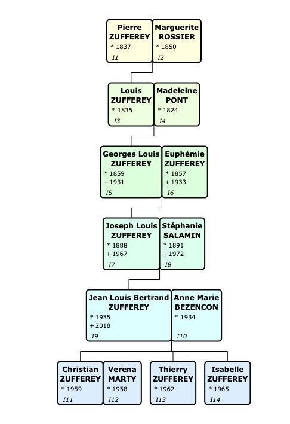
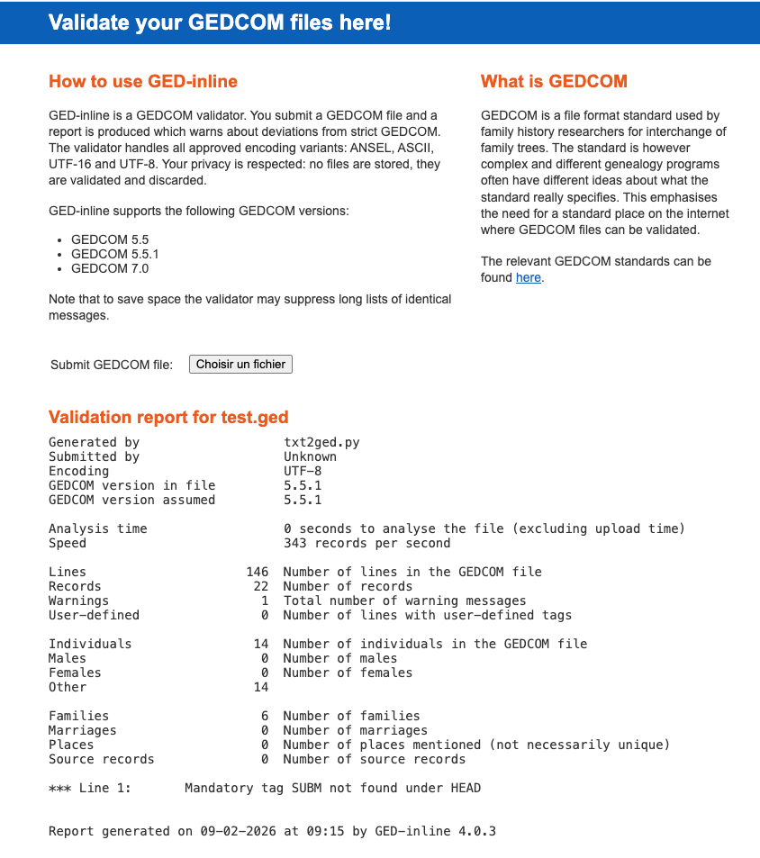

# Essais de petit script pour convertir un arbre généalogique de format texte en format gedcom avec l'IA (Copilot)
zf260206.1635, 260317.0942

## Buts
Faire un petit bench de démo pour tester les possibilités de *Copilot Agent* dans VScode pour écrire du code avec différents LLM, en particulier des LMM locaux avec Ollama.


## Utilisation
Choisir le bon LLM dans la fenêtre Copilot Agent à droite dans VSCode !

Copier le contenu du fichier **prompt.txt** ou **prompt-minimal.txt** dans le chat Coplilot, ajouter comme annexe le fichier **input.txt** et cliquer sur la flèche **send**


## Essais répétitifs avec différents modèles
Le problème avec les *IA*, c'est qu'elles ne sont pas *répétitifs* ! A chaque essais on peut avoir une réponse un peut différentes et ne pas réussir du premier coup le *bench*.

Afin d'être certains de pouvoir comparer les *benches*, avant le lancement, il faut effacer les fichiers générés avec:
````
rm test.ged txt2ged.py
````
Il faut aussi effacer la *pensée* du Copilot Agent en effacçant la session en haut à droite.<br>
Cela va obliger de tout recommencer depuis le début


## Validations du GEDCOM
Il faut utiliser le viewer Topola pour la vérification *visuelle* de la qualité du fichier GEDCOM:

https://pewu.github.io/topola-viewer/



Et *Ged-Inline* pour la vérification *syntaxique* de la qualité du fichier GEDCOM:

https://ged-inline.org/




## Remarques
### Simplification du prompt
J'ai constaté, avec les modèles en local sur Ollama, que plus le *prompt* était détaillé, plus il perdait les pédalles et n'arrivait à rien. Si on fait un *prompt* minimaliste, il s'en sort quasiment du 1er coup !

### Qwen3-coder triche et tourne en rond à cause d'un contexte trop petit (55k) !
Avec qwen3-coder, il *triche*, j'ai vu qu'il s'inspirait des résultats des autres. J'ai donc dû *chiffre*r les résultats afin qu'il ne puisse pas les utiliser dans son raisonnement !
Et finalement il a tourné en rond et pas réussi. C'est sûrement à cause que je n'ai pas pu *monter* la fenêtre de contexte à plus de 55k, car il ne *tenait* plus dans les 24GB de la VRAM de ma NVIDIA 3090.

### Echec manifeste des modèles Ollama locaux sur GPU 24GB VRAM
Après un wk de tests je dois constater que l'utilisation des modèles locaux sur un Ollama GPU 24GB de VRAM n'est pas suffisant pour résoudre ce bench. Principalement à cause de la fenêtre de contexte qui fait *sauter* la VRAM du GPU !
En utilisant la version pro de Github Copilot Agent, en moins de 15 secondes ce bench a été résolu du 1er coup avec Claude Sonnet 4.5 \o/


## Astuces de travail

### Comment diminuer la taille du prompt dans le terminal bash ?
Il suffit simplement de faire ceci:
```
PS1='\$ '
```
On peut le rendre permanent avec:
```bash
echo -e "PS1='\$ '" >> ~/.bashrc
```
